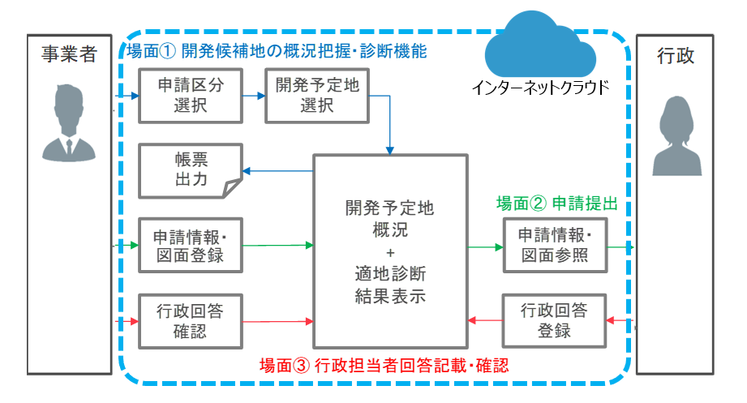

# FY2022 Project PLATEAU UC22-012「開発許可のDX」の成果物
### development-permission

## **1. 概要**
3D都市モデルをはじめとする地理空間情報を用いて市町村等が行う煩雑な開発許可手続きの効率化を支援するシステムです。  
GISを三次元表示可能なCesiumJS及びTerriaJSをフロントエンドで利用し、PostGISとGeoServerを組み合わせ、空間解析機能及びリレーショナルデータベースをバックエンドで統合したウェブシステムとなります。  
主な機能として以下を実装しています。  
①地番図を用いた検索機能  
②概況診断結果のレポート出力機能  
③行政担当者への申請機能  
④行政担当者の申請情報検索及び回答確認機能  

本ドキュメントは、本システムの利用手順を記載した資料となります。  
詳細につきましては、以下を参照ください。  
[環境構築手順書](https://project-plateau.github.io/UC22-012-development-permission/manual/environment.html)  
[開発許可申請管理システム　操作マニュアル](https://project-plateau.github.io/UC22-012-development-permission/manual/user_manual.html)  
[技術実証レポート](https://www.mlit.go.jp/plateau/file/libraries/doc/plateau_tech_doc_0024_ver01.pdf)    

## **2．「開発許可のDX」について**
### **ユースケースの概要**
市街地等において一定規模以上の開発を行う場合、都市計画法に基づく開発許可が必要となり、令和元年では2万件以上の許可が全国で行われています。
開発許可制度は、申請のあった開発行為が対象エリアの土地利用の計画や災害リスク等の状況と適合しているかの審査を行うものですが、
審査に必要な関連資料の収集や関係者との協議等が多岐にわたるため、審査側の行政と申請側の民間の双方で多大な事務負担となっています。
本システムは、事業者の情報収集と行政側の審査の双方の事務の効率化を図るため、土地利用、都市計画、各種規制等の情報を3D都市モデルに統合し、対象エリアにおける開発行為の適地診断・申請を支援することを目的に開発されました。

### **開発システムの概要**
空間情報を三次元表示可能なCesiumJS及びTerriaJSをフロントエンドで利用するとともに、PostGIS（空間情報を管理するOSSのデータベース拡張機能）と
GeoServer（空間情報を共有するOSSのGISサーバ）を組み合わせ、空間解析機能及びリレーショナルデータベースをバックエンドで統合したウェブシステムを開発しました。
開発したシステムには、①地番図を用いた検索機能、②概況診断結果のレポート出力機能、③行政担当者への申請機能、④行政担当者の申請情報検索及び回答確認機能を実装しています。

## **3．利用手順**
### **インストール**

* 本システムで必要となるソフトウェアを下表に示します。
[環境構築手順書](https://project-plateau.github.io/UC22-012-development-permission/manual/environment.html)を参照の上、ソフトウェアのインストール及びセットアップを完了させてください。

    |ソフトウェア|プロジェクトフォルダ|
    | - | - |
    |1.GeoServer|-|
    |2.API|[/SRC/api](./SRC/api/)|
    |3.3dviewer|[/SRC/3dview](./SRC/3dview/)|

    ※データベースの構築及びミドルウェアのセットアップも合わせて必要となります。
* 構築時に必要となる環境設定ファイルを下表に示します。

    |ファイル|プロジェクトフォルダ|備考|
    | - | - | - |
    |1.環境設定ファイル一式|[/Settings/environmant_settings](Settings/environment_settings/)|各ファイルについては[環境構築手順書](https://project-plateau.github.io/UC22-012-development-permission/manual/environment.html)を参照してください。

### **使い方**

#### **利用できる動作環境**

最新のデスクトップ版　Chrome、Edge上 
最小システム要件　CPU：2GHｚデュアルコア以上、システムメモリ（RAM）：4GB以上

#### **操作マニュアル**

本システムの使い方は下記の操作マニュアルを参照ください。 
[開発許可申請管理システム　操作マニュアル](https://project-plateau.github.io/UC22-012-development-permission/manual/user_manual.html)

#### 本システムの全体像を下記に示します。

## **ライセンス** <!-- 定型文のため変更しない -->
* ソースコードおよび関連ドキュメントの著作権は国土交通省に帰属します。
* 本ドキュメントは[Project PLATEAUのサイトポリシー](https://www.mlit.go.jp/plateau/site-policy/)（CCBY4.0および政府標準利用規約2.0）に従い提供されています。

## **注意事項** <!-- 定型文のため変更しない -->

* 本レポジトリは参考資料として提供しているものです。動作保証は行っておりません。
* 予告なく変更・削除する可能性があります。
* 本レポジトリの利用により生じた損失及び損害等について、国土交通省はいかなる責任も負わないものとします。

## **参考資料**　 <!-- 各リンクは納品時に更新 -->
* 開発許可のDX 技術検証レポート: https://www.mlit.go.jp/plateau/file/libraries/doc/plateau_tech_doc_0024_ver01.pdf
* PLATEAU Webサイト Use caseページ「開発許可のDX」: https://www.mlit.go.jp/plateau/use-case/uc22-012/
* Project-PLATEAU PLATEAU-VIEW:https://github.com/Project-PLATEAU/PLATEAU-VIEW
* Project-PLATEAU terriajs:https://github.com/Project-PLATEAU/terriajs
* GeoServer:https://geoserver.org/
